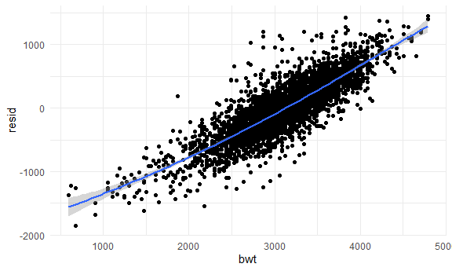
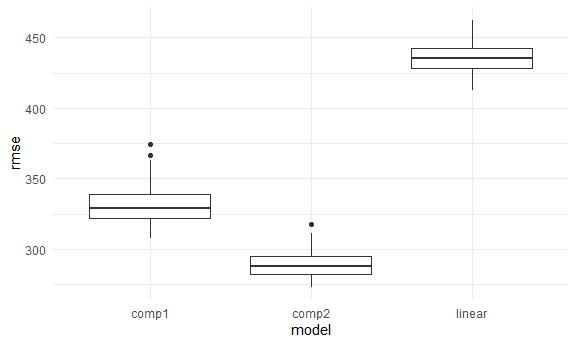

Homework 6
================
Safiya Sirota
2021-12-04

-   [Problem 1](#problem-1)
-   [Problem 2](#problem-2)

## Problem 1

**Importing and cleaning the data:**

``` r
birthwt_df <- read_csv("data/birthweight.csv") %>% 
  mutate(
    babysex = as.factor(babysex),
    frace = as.factor(frace),
    malform = as.factor(malform),
    mrace = as.factor(mrace)
  )
```

    ## Rows: 4342 Columns: 20

    ## -- Column specification --------------------------------------------------------
    ## Delimiter: ","
    ## dbl (20): babysex, bhead, blength, bwt, delwt, fincome, frace, gaweeks, malf...

    ## 
    ## i Use `spec()` to retrieve the full column specification for this data.
    ## i Specify the column types or set `show_col_types = FALSE` to quiet this message.

``` r
map(birthwt_df, ~sum(is.na(.)))
```

    ## $babysex
    ## [1] 0
    ## 
    ## $bhead
    ## [1] 0
    ## 
    ## $blength
    ## [1] 0
    ## 
    ## $bwt
    ## [1] 0
    ## 
    ## $delwt
    ## [1] 0
    ## 
    ## $fincome
    ## [1] 0
    ## 
    ## $frace
    ## [1] 0
    ## 
    ## $gaweeks
    ## [1] 0
    ## 
    ## $malform
    ## [1] 0
    ## 
    ## $menarche
    ## [1] 0
    ## 
    ## $mheight
    ## [1] 0
    ## 
    ## $momage
    ## [1] 0
    ## 
    ## $mrace
    ## [1] 0
    ## 
    ## $parity
    ## [1] 0
    ## 
    ## $pnumlbw
    ## [1] 0
    ## 
    ## $pnumsga
    ## [1] 0
    ## 
    ## $ppbmi
    ## [1] 0
    ## 
    ## $ppwt
    ## [1] 0
    ## 
    ## $smoken
    ## [1] 0
    ## 
    ## $wtgain
    ## [1] 0

``` r
map(birthwt_df, ~sum(is.character(.)))
```

    ## $babysex
    ## [1] 0
    ## 
    ## $bhead
    ## [1] 0
    ## 
    ## $blength
    ## [1] 0
    ## 
    ## $bwt
    ## [1] 0
    ## 
    ## $delwt
    ## [1] 0
    ## 
    ## $fincome
    ## [1] 0
    ## 
    ## $frace
    ## [1] 0
    ## 
    ## $gaweeks
    ## [1] 0
    ## 
    ## $malform
    ## [1] 0
    ## 
    ## $menarche
    ## [1] 0
    ## 
    ## $mheight
    ## [1] 0
    ## 
    ## $momage
    ## [1] 0
    ## 
    ## $mrace
    ## [1] 0
    ## 
    ## $parity
    ## [1] 0
    ## 
    ## $pnumlbw
    ## [1] 0
    ## 
    ## $pnumsga
    ## [1] 0
    ## 
    ## $ppbmi
    ## [1] 0
    ## 
    ## $ppwt
    ## [1] 0
    ## 
    ## $smoken
    ## [1] 0
    ## 
    ## $wtgain
    ## [1] 0

In this step, we change some numeric variables to factor variables and
check for missing values, although we find none.

**Fitting a linear model**

Let’s assume we would like to make predictions of birth weight using our
model in order to help clinician’s identify at-risk pregnancies. In this
case, we would not want to include predictors whose values can only be
measured on the day of birth or *after* birth.

I also will exclude the two race predictors. I think they are
inappropriate since there is no biological difference in babies of
different races. The researchers are probably using these variables as a
proxy for measures like socioeconomic status and nutrition, which do
vary by race due to societal discrimination. Since we do not have
information on these variables directly, it seems incorrect to attach
these all to the race variables and to make interpretations or
predictions based on race alone.

To find our linear model, we will use a stepwise process to find the
model with the lowest AIC. But the full model we start with will exlude
some variables as described above.

``` r
full_model <- lm(bwt ~ babysex + fincome + gaweeks + malform + menarche + momage + parity + pnumlbw + pnumsga + ppbmi + ppwt + smoken + wtgain, data = birthwt_df)

fit <- stepAIC(full_model, direction = "both", trace = FALSE)

broom::tidy(fit)
```

    ## # A tibble: 11 x 5
    ##    term        estimate std.error statistic   p.value
    ##    <chr>          <dbl>     <dbl>     <dbl>     <dbl>
    ##  1 (Intercept)   121.     113.         1.07 2.84e-  1
    ##  2 babysex2      -89.8     13.3       -6.78 1.36e- 11
    ##  3 fincome         1.74     0.272      6.38 1.93e- 10
    ##  4 gaweeks        58.4      2.15      27.1  1.31e-149
    ##  5 menarche       -8.14     4.61      -1.77 7.76e-  2
    ##  6 momage          8.83     1.87       4.72 2.46e-  6
    ##  7 parity        105.      64.6        1.62 1.05e-  1
    ##  8 ppbmi         -25.5      4.06      -6.27 3.89e- 10
    ##  9 ppwt            7.71     0.638     12.1  4.92e- 33
    ## 10 smoken         -8.21     0.898     -9.14 9.06e- 20
    ## 11 wtgain          9.63     0.620     15.5  4.67e- 53

This method left in the parity variable, which is insignificant, so I
will remove it manually to get the final linear model.

``` r
linear_fit <- lm(bwt ~ babysex + fincome + gaweeks + menarche + momage + ppbmi + ppwt + smoken + wtgain, data = birthwt_df)
```

Let’s check some diagnostic plots to make sure we see linearity and
normality of the residuals.

``` r
modelr::add_residuals(birthwt_df, linear_fit) %>% 
  ggplot(aes(x = bwt, y = resid)) +
  geom_point() +
  geom_smooth(aes(y = resid))
```

    ## `geom_smooth()` using method = 'gam' and formula 'y ~ s(x, bs = "cs")'



``` r
modelr::add_residuals(birthwt_df, linear_fit) %>% 
  ggplot(aes(x = resid)) +
  geom_density() 
```


The pattern we see here looks linear and the residuals look normal,
which is what we want. We could test a non-linear regression model, but
since our linear model looks like it satisfies the residual assumptions
and is easier to interpret, I will stick with it.

**Residual vs fitted values plot:**

``` r
birthwt_df %>% 
  modelr::add_residuals(linear_fit) %>% 
  modelr::add_predictions(linear_fit) %>% 
  ggplot(aes(x = pred, y = resid)) +
  geom_point() +
  geom_abline(aes(slope = 0, intercept = 0), color = "red")
```


Again, this plot seems to support linearity as the residuals seem about
equally distributed above and below the y = 0 line. Even though there
are fewer data points on the left side of the x-axis, variance seems
about even throughout.

**Comparing model to two others:**

Now we will see how our model holds up against the following two
alternatives.

``` r
comp_1 <- lm(bwt ~ blength + gaweeks, data = birthwt_df)
comp_2 <- lm(bwt ~ bhead + blength + babysex + bhead*blength*babysex, data = birthwt_df)
```

Now, let’s split our data into training and testing sections.

``` r
cv_df <-
  crossv_mc(birthwt_df, 100) %>% 
  mutate(
    train = map(train, as_tibble),
    test = map(test, as_tibble)
  )
```

Lastly, let’s fit the models and extract the RMSE’s.

``` r
cv_df <-
  cv_df %>% 
    mutate(
      linear_fit = map(.x = train, ~lm(bwt ~ babysex + fincome + gaweeks + menarche + momage + ppbmi + ppwt + smoken + wtgain, data = .x)),
      comp_1 = map(.x = train, ~lm(bwt ~ blength + gaweeks, data = .x)),
      comp_2 = map(.x = train, ~lm(bwt ~ bhead + blength + babysex + bhead*blength*babysex, data = .x))
      ) %>% 
    mutate(
      rmse_linear = map2_dbl(.x = linear_fit, .y = test, ~rmse(model = .x, data = .y)),
      rmse_comp1 = map2_dbl(.x = comp_1, .y = test, ~rmse(model = .x, data = .y)),
      rmse_comp2 = map2_dbl(.x = comp_2, .y = test, ~rmse(model = .x, data = .y))
    )
```

Now, we can look at the model distributions in terms of RMSE.

``` r
cv_df %>% 
  dplyr::select(.id, starts_with("rmse")) %>% 
  pivot_longer(
    rmse_linear:rmse_comp2,
    names_to = "model",
    values_to = "rmse",
    names_prefix = "rmse_"
  ) %>% 
  ggplot(aes(x = model, y = rmse)) +
  geom_boxplot()
```



My model has a much worse fit than the comparison models. The second
model, which includes head circumference, length, sex, and all their
interactions, has a very low RMSE relative to the other two models.

I expected this result because I explicitly excluded potential variables
from my model that I knew could not be accessed before the baby was
born. Although the two comparison models have better fit, my model could
be used to address the problem I mentioned: identifying at-risk mothers
for low birth weight babies before the babies are delivered.

## Problem 2

**Importing data:**

``` r
weather_df <-
  rnoaa::meteo_pull_monitors(
    c("USW00094728"),
    var = c("PRCP", "TMIN", "TMAX"), 
    date_min = "2017-01-01",
    date_max = "2017-12-31") %>%
  mutate(
    name = recode(id, USW00094728 = "CentralPark_NY"),
    tmin = tmin / 10,
    tmax = tmax / 10) %>%
  dplyr::select(name, id, everything())
```

**Bootstrapping:**

First, I will write a function to calculate the log of the product of

and

from a `broom::tidy(fit)` result and a function to get the

value from a `broom::glance(fit)` result that will come in handy later.

``` r
log_coefs <- function(result) {
  
  log(pull(filter(result, term == "(Intercept)"), estimate) * pull(filter(result, term == "tmin"), estimate))
  
}

r2 <- function(result) {
  
  pull(result, r.squared)
  
}
```

Now we can bootstrap to find the distributions of our quantities of
interest.

``` r
set.seed(1)

weather_bootstrap <-
  weather_df %>% 
    bootstrap(n = 5000, id = "strap_number") %>% 
    mutate(
      models = map(.x = strap, ~lm(tmax ~ tmin, data = .x)),
      coef_results = map(models, broom::tidy),
      rsquare_results = map(models, broom::glance)
    ) %>% 
    dplyr::select(strap_number, coef_results, rsquare_results) %>% 
    mutate(
      log_b0_b1 = map(coef_results, log_coefs),
      r_sq = map(rsquare_results, r2)
    ) %>% 
    dplyr::select(strap_number, log_b0_b1, r_sq) %>% 
    unnest(log_b0_b1:r_sq)
```

**Plotting the distributions:**

``` r
b0_b1_ggp <-
weather_bootstrap %>% 
  ggplot(aes(x = log_b0_b1)) +
  geom_density()

r2_ggp <-
weather_bootstrap %>% 
  ggplot(aes(x = r_sq)) +
  geom_density()

b0_b1_ggp + r2_ggp
```


The distribution for
")
seems normal around a mean of about 2.01. The distribution of

also seems about normal, but with a slight left skew, around a mean of
about 0.915.

**Finding confidence intervals:**

``` r
quantile(pull(weather_bootstrap, log_b0_b1), probs = c(.025, .975))
```

    ##     2.5%    97.5% 
    ## 1.964949 2.058887

``` r
quantile(pull(weather_bootstrap, r_sq), probs = c(.025, .975))
```

    ##      2.5%     97.5% 
    ## 0.8936684 0.9271060

From bootstrapping,

-   our estimate for
    
    is 0.911 (95% CI \[0.894, 0.927\]),

-   our estimate for
    ")
    is 2.013 (95% CI \[1.965, 2.059\]).
