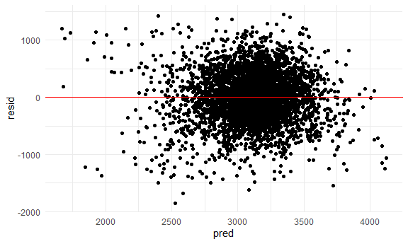

Homework 6
================
Safiya Sirota
2021-12-04

-   [Problem 1](#problem-1)
-   [Problem 2](#problem-2)

## Problem 1

**Importing and cleaning the data:**

``` r
birthwt_df <- read_csv("data/birthweight.csv") %>% 
  mutate(
    babysex = as.factor(babysex),
    frace = as.factor(frace),
    malform = as.factor(malform),
    mrace = as.factor(mrace)
  )
```

    ## Rows: 4342 Columns: 20

    ## -- Column specification --------------------------------------------------------
    ## Delimiter: ","
    ## dbl (20): babysex, bhead, blength, bwt, delwt, fincome, frace, gaweeks, malf...

    ## 
    ## i Use `spec()` to retrieve the full column specification for this data.
    ## i Specify the column types or set `show_col_types = FALSE` to quiet this message.

``` r
map(birthwt_df, ~sum(is.na(.)))
```

    ## $babysex
    ## [1] 0
    ## 
    ## $bhead
    ## [1] 0
    ## 
    ## $blength
    ## [1] 0
    ## 
    ## $bwt
    ## [1] 0
    ## 
    ## $delwt
    ## [1] 0
    ## 
    ## $fincome
    ## [1] 0
    ## 
    ## $frace
    ## [1] 0
    ## 
    ## $gaweeks
    ## [1] 0
    ## 
    ## $malform
    ## [1] 0
    ## 
    ## $menarche
    ## [1] 0
    ## 
    ## $mheight
    ## [1] 0
    ## 
    ## $momage
    ## [1] 0
    ## 
    ## $mrace
    ## [1] 0
    ## 
    ## $parity
    ## [1] 0
    ## 
    ## $pnumlbw
    ## [1] 0
    ## 
    ## $pnumsga
    ## [1] 0
    ## 
    ## $ppbmi
    ## [1] 0
    ## 
    ## $ppwt
    ## [1] 0
    ## 
    ## $smoken
    ## [1] 0
    ## 
    ## $wtgain
    ## [1] 0

``` r
map(birthwt_df, ~sum(is.character(.)))
```

    ## $babysex
    ## [1] 0
    ## 
    ## $bhead
    ## [1] 0
    ## 
    ## $blength
    ## [1] 0
    ## 
    ## $bwt
    ## [1] 0
    ## 
    ## $delwt
    ## [1] 0
    ## 
    ## $fincome
    ## [1] 0
    ## 
    ## $frace
    ## [1] 0
    ## 
    ## $gaweeks
    ## [1] 0
    ## 
    ## $malform
    ## [1] 0
    ## 
    ## $menarche
    ## [1] 0
    ## 
    ## $mheight
    ## [1] 0
    ## 
    ## $momage
    ## [1] 0
    ## 
    ## $mrace
    ## [1] 0
    ## 
    ## $parity
    ## [1] 0
    ## 
    ## $pnumlbw
    ## [1] 0
    ## 
    ## $pnumsga
    ## [1] 0
    ## 
    ## $ppbmi
    ## [1] 0
    ## 
    ## $ppwt
    ## [1] 0
    ## 
    ## $smoken
    ## [1] 0
    ## 
    ## $wtgain
    ## [1] 0

**Fitting a linear model**

``` r
map(birthwt_df, ~cor.test(as.numeric(.), birthwt_df$bwt))
```

    ## Warning in cor(x, y): the standard deviation is zero

    ## Warning in cor(x, y): the standard deviation is zero

    ## $babysex
    ## 
    ##  Pearson's product-moment correlation
    ## 
    ## data:  as.numeric(.) and birthwt_df$bwt
    ## t = -5.7294, df = 4340, p-value = 1.076e-08
    ## alternative hypothesis: true correlation is not equal to 0
    ## 95 percent confidence interval:
    ##  -0.11608837 -0.05704304
    ## sample estimates:
    ##         cor 
    ## -0.08664179 
    ## 
    ## 
    ## $bhead
    ## 
    ##  Pearson's product-moment correlation
    ## 
    ## data:  as.numeric(.) and birthwt_df$bwt
    ## t = 74.046, df = 4340, p-value < 2.2e-16
    ## alternative hypothesis: true correlation is not equal to 0
    ## 95 percent confidence interval:
    ##  0.7336655 0.7599637
    ## sample estimates:
    ##       cor 
    ## 0.7471068 
    ## 
    ## 
    ## $blength
    ## 
    ##  Pearson's product-moment correlation
    ## 
    ## data:  as.numeric(.) and birthwt_df$bwt
    ## t = 73.233, df = 4340, p-value < 2.2e-16
    ## alternative hypothesis: true correlation is not equal to 0
    ## 95 percent confidence interval:
    ##  0.7298452 0.7564676
    ## sample estimates:
    ##       cor 
    ## 0.7434508 
    ## 
    ## 
    ## $bwt
    ## 
    ##  Pearson's product-moment correlation
    ## 
    ## data:  as.numeric(.) and birthwt_df$bwt
    ## t = Inf, df = 4340, p-value < 2.2e-16
    ## alternative hypothesis: true correlation is not equal to 0
    ## 95 percent confidence interval:
    ##  1 1
    ## sample estimates:
    ## cor 
    ##   1 
    ## 
    ## 
    ## $delwt
    ## 
    ##  Pearson's product-moment correlation
    ## 
    ## data:  as.numeric(.) and birthwt_df$bwt
    ## t = 19.804, df = 4340, p-value < 2.2e-16
    ## alternative hypothesis: true correlation is not equal to 0
    ## 95 percent confidence interval:
    ##  0.2603732 0.3149381
    ## sample estimates:
    ##       cor 
    ## 0.2878893 
    ## 
    ## 
    ## $fincome
    ## 
    ##  Pearson's product-moment correlation
    ## 
    ## data:  as.numeric(.) and birthwt_df$bwt
    ## t = 10.307, df = 4340, p-value < 2.2e-16
    ## alternative hypothesis: true correlation is not equal to 0
    ## 95 percent confidence interval:
    ##  0.1254023 0.1834737
    ## sample estimates:
    ##       cor 
    ## 0.1545715 
    ## 
    ## 
    ## $frace
    ## 
    ##  Pearson's product-moment correlation
    ## 
    ## data:  as.numeric(.) and birthwt_df$bwt
    ## t = -13.01, df = 4340, p-value < 2.2e-16
    ## alternative hypothesis: true correlation is not equal to 0
    ## 95 percent confidence interval:
    ##  -0.2222097 -0.1649494
    ## sample estimates:
    ##        cor 
    ## -0.1937446 
    ## 
    ## 
    ## $gaweeks
    ## 
    ##  Pearson's product-moment correlation
    ## 
    ## data:  as.numeric(.) and birthwt_df$bwt
    ## t = 29.804, df = 4340, p-value < 2.2e-16
    ## alternative hypothesis: true correlation is not equal to 0
    ## 95 percent confidence interval:
    ##  0.3871847 0.4365764
    ## sample estimates:
    ##       cor 
    ## 0.4121833 
    ## 
    ## 
    ## $malform
    ## 
    ##  Pearson's product-moment correlation
    ## 
    ## data:  as.numeric(.) and birthwt_df$bwt
    ## t = 0.087833, df = 4340, p-value = 0.93
    ## alternative hypothesis: true correlation is not equal to 0
    ## 95 percent confidence interval:
    ##  -0.02841364  0.03107778
    ## sample estimates:
    ##         cor 
    ## 0.001333249 
    ## 
    ## 
    ## $menarche
    ## 
    ##  Pearson's product-moment correlation
    ## 
    ## data:  as.numeric(.) and birthwt_df$bwt
    ## t = -1.6095, df = 4340, p-value = 0.1076
    ## alternative hypothesis: true correlation is not equal to 0
    ## 95 percent confidence interval:
    ##  -0.054131100  0.005324969
    ## sample estimates:
    ##         cor 
    ## -0.02442466 
    ## 
    ## 
    ## $mheight
    ## 
    ##  Pearson's product-moment correlation
    ## 
    ## data:  as.numeric(.) and birthwt_df$bwt
    ## t = 12.9, df = 4340, p-value < 2.2e-16
    ## alternative hypothesis: true correlation is not equal to 0
    ## 95 percent confidence interval:
    ##  0.1633512 0.2206477
    ## sample estimates:
    ##       cor 
    ## 0.1921632 
    ## 
    ## 
    ## $momage
    ## 
    ##  Pearson's product-moment correlation
    ## 
    ## data:  as.numeric(.) and birthwt_df$bwt
    ## t = 9.0282, df = 4340, p-value < 2.2e-16
    ## alternative hypothesis: true correlation is not equal to 0
    ## 95 percent confidence interval:
    ##  0.1064576 0.1648534
    ## sample estimates:
    ##       cor 
    ## 0.1357734 
    ## 
    ## 
    ## $mrace
    ## 
    ##  Pearson's product-moment correlation
    ## 
    ## data:  as.numeric(.) and birthwt_df$bwt
    ## t = -13.986, df = 4340, p-value < 2.2e-16
    ## alternative hypothesis: true correlation is not equal to 0
    ## 95 percent confidence interval:
    ##  -0.2359571 -0.1790291
    ## sample estimates:
    ##        cor 
    ## -0.2076689 
    ## 
    ## 
    ## $parity
    ## 
    ##  Pearson's product-moment correlation
    ## 
    ## data:  as.numeric(.) and birthwt_df$bwt
    ## t = -0.55169, df = 4340, p-value = 0.5812
    ## alternative hypothesis: true correlation is not equal to 0
    ## 95 percent confidence interval:
    ##  -0.03811038  0.02137698
    ## sample estimates:
    ##          cor 
    ## -0.008374112 
    ## 
    ## 
    ## $pnumlbw
    ## 
    ##  Pearson's product-moment correlation
    ## 
    ## data:  as.numeric(.) and birthwt_df$bwt
    ## t = NA, df = 4340, p-value = NA
    ## alternative hypothesis: true correlation is not equal to 0
    ## 95 percent confidence interval:
    ##  NA NA
    ## sample estimates:
    ## cor 
    ##  NA 
    ## 
    ## 
    ## $pnumsga
    ## 
    ##  Pearson's product-moment correlation
    ## 
    ## data:  as.numeric(.) and birthwt_df$bwt
    ## t = NA, df = 4340, p-value = NA
    ## alternative hypothesis: true correlation is not equal to 0
    ## 95 percent confidence interval:
    ##  NA NA
    ## sample estimates:
    ## cor 
    ##  NA 
    ## 
    ## 
    ## $ppbmi
    ## 
    ##  Pearson's product-moment correlation
    ## 
    ## data:  as.numeric(.) and birthwt_df$bwt
    ## t = 6.2165, df = 4340, p-value = 5.561e-10
    ## alternative hypothesis: true correlation is not equal to 0
    ## 95 percent confidence interval:
    ##  0.06437987 0.12334680
    ## sample estimates:
    ##        cor 
    ## 0.09394573 
    ## 
    ## 
    ## $ppwt
    ## 
    ##  Pearson's product-moment correlation
    ## 
    ## data:  as.numeric(.) and birthwt_df$bwt
    ## t = 12.255, df = 4340, p-value < 2.2e-16
    ## alternative hypothesis: true correlation is not equal to 0
    ## 95 percent confidence interval:
    ##  0.1539839 0.2114872
    ## sample estimates:
    ##      cor 
    ## 0.182892 
    ## 
    ## 
    ## $smoken
    ## 
    ##  Pearson's product-moment correlation
    ## 
    ## data:  as.numeric(.) and birthwt_df$bwt
    ## t = -4.9966, df = 4340, p-value = 6.066e-07
    ## alternative hypothesis: true correlation is not equal to 0
    ## 95 percent confidence interval:
    ##  -0.10513705 -0.04598549
    ## sample estimates:
    ##         cor 
    ## -0.07562781 
    ## 
    ## 
    ## $wtgain
    ## 
    ##  Pearson's product-moment correlation
    ## 
    ## data:  as.numeric(.) and birthwt_df$bwt
    ## t = 16.811, df = 4340, p-value < 2.2e-16
    ## alternative hypothesis: true correlation is not equal to 0
    ## 95 percent confidence interval:
    ##  0.2191184 0.2749760
    ## sample estimates:
    ##       cor 
    ## 0.2472526

sex, head, delwt, fincome, frace, gaweeks, mheight, momage, mrace,
ppbmi, smoken, and wtgain significantly correlated

``` r
fit <- lm(bwt ~ babysex + bhead + delwt + frace + gaweeks + mheight + momage + mrace + ppbmi + smoken + wtgain, data = birthwt_df)
broom::tidy(fit)
```

    ## # A tibble: 17 x 5
    ##    term         estimate std.error statistic  p.value
    ##    <chr>           <dbl>     <dbl>     <dbl>    <dbl>
    ##  1 (Intercept) -5640.      756.      -7.46   1.05e-13
    ##  2 babysex2       22.5       9.71     2.32   2.04e- 2
    ##  3 bhead         198.        3.37    58.7    0       
    ##  4 delwt           0.665     2.96     0.224  8.22e- 1
    ##  5 frace2        -15.2      52.9     -0.288  7.73e- 1
    ##  6 frace3         26.6      79.5      0.334  7.38e- 1
    ##  7 frace4        -35.9      51.2     -0.701  4.83e- 1
    ##  8 frace8        -31.5      85.0     -0.371  7.11e- 1
    ##  9 gaweeks        19.8       1.66    11.9    2.49e-32
    ## 10 mheight        16.5      11.8      1.40   1.62e- 1
    ## 11 momage         -0.117     1.34    -0.0874 9.30e- 1
    ## 12 mrace2       -160.       52.9     -3.02   2.50e- 3
    ## 13 mrace3       -102.       82.6     -1.24   2.15e- 1
    ## 14 mrace4        -94.7      51.8     -1.83   6.76e- 2
    ## 15 ppbmi           7.46     17.1      0.437  6.62e- 1
    ## 16 smoken         -6.73      0.671  -10.0    2.21e-23
    ## 17 wtgain          4.84      3.00     1.62   1.06e- 1

We can get rid of the insignificant variables

``` r
fit2 <- lm(bwt ~ babysex + bhead + gaweeks + mrace + smoken, data = birthwt_df)
broom::tidy(fit2)
```

    ## # A tibble: 8 x 5
    ##   term        estimate std.error statistic  p.value
    ##   <chr>          <dbl>     <dbl>     <dbl>    <dbl>
    ## 1 (Intercept) -4712.     112.       -42.2  0       
    ## 2 babysex2       26.2     10.0        2.62 8.93e- 3
    ## 3 bhead         210.       3.39      62.0  0       
    ## 4 gaweeks        21.6      1.70      12.7  1.83e-36
    ## 5 mrace2       -168.      10.8      -15.5  8.65e-53
    ## 6 mrace3       -140.      49.8       -2.82 4.86e- 3
    ## 7 mrace4       -178.      22.0       -8.08 8.47e-16
    ## 8 smoken         -5.92     0.689     -8.59 1.17e-17

Graph residuals

``` r
modelr::add_residuals(birthwt_df, fit2) %>% 
  ggplot(aes(x = bwt, y = resid)) +
  geom_point()
```



``` r
#not totally linear

modelr::add_residuals(birthwt_df, fit2) %>% 
  ggplot(aes(x = resid)) +
  geom_density()
```


``` r
#add predictions
```

## Problem 2

**Importing data:**

``` r
weather_df <-
  rnoaa::meteo_pull_monitors(
    c("USW00094728"),
    var = c("PRCP", "TMIN", "TMAX"), 
    date_min = "2017-01-01",
    date_max = "2017-12-31") %>%
  mutate(
    name = recode(id, USW00094728 = "CentralPark_NY"),
    tmin = tmin / 10,
    tmax = tmax / 10) %>%
  select(name, id, everything())
```

    ## Registered S3 method overwritten by 'hoardr':
    ##   method           from
    ##   print.cache_info httr

    ## using cached file: C:\Users\safiy\AppData\Local/Cache/R/noaa_ghcnd/USW00094728.dly

    ## date created (size, mb): 2021-10-05 10:31:17 (7.617)

    ## file min/max dates: 1869-01-01 / 2021-10-31

r^2 log(β<sup>0∗β</sup>1)

Use 5000 bootstrap samples and, for each bootstrap sample, produce
estimates of these two quantities. Plot the distribution of your
estimates, and describe these in words. Using the 5000 bootstrap
estimates, identify the 2.5% and 97.5% quantiles to provide a 95%
confidence interval for r^2 and log(β<sup>0∗β</sup>1). Note:
broom::glance() is helpful for extracting r^2 from a fitted regression,
and broom::tidy() (with some additional wrangling) should help in
computing log(β<sup>0∗β</sup>1).

``` r
weather_df %>% 
  bootstrap(n = 5000, id = "strap_number") %>% 
  mutate(
    models = map(.x = strap, ~lm(tmax ~ tmin, data = .x)),
    results = map(models, broom::tidy)
  ) %>% 
  select(strap_number, results) %>% 
  unnest(results)
```

    ## # A tibble: 10,000 x 6
    ##    strap_number term        estimate std.error statistic   p.value
    ##    <chr>        <chr>          <dbl>     <dbl>     <dbl>     <dbl>
    ##  1 0001         (Intercept)     7.19    0.226       31.9 3.12e-107
    ##  2 0001         tmin            1.05    0.0170      62.1 1.99e-195
    ##  3 0002         (Intercept)     7.15    0.214       33.4 7.12e-113
    ##  4 0002         tmin            1.04    0.0158      66.1 2.22e-204
    ##  5 0003         (Intercept)     7.12    0.219       32.5 1.45e-109
    ##  6 0003         tmin            1.04    0.0166      62.3 5.71e-196
    ##  7 0004         (Intercept)     6.92    0.218       31.8 7.87e-107
    ##  8 0004         tmin            1.05    0.0162      65.2 1.50e-202
    ##  9 0005         (Intercept)     7.06    0.225       31.4 1.34e-105
    ## 10 0005         tmin            1.04    0.0164      63.4 2.41e-198
    ## # ... with 9,990 more rows
